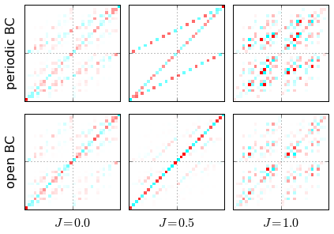

qubism
======

Self-similar visualization of many-body wavefunctions (and also: time series, DNA, proteins).

* J. Rodriguez-Laguna, P. Migdał, M. Ibanez Berganza, M. Lewenstein, G. Sierra,
  Qubism: self-similar visualization of many-body wavefunctions,
  [New J. Phys. 14 053028](http://dx.doi.org/10.1088/1367-2630/14/5/053028) (2012),
  [arXiv:1112.3560](http://arxiv.org/abs/1112.3560)
* Other materials: [poster](http://dx.doi.org/10.6084/m9.figshare.97233),
  [video abstract](http://www.youtube.com/watch?v=tfJHjpyQn0I)
* Current homepage: http://qubism.wikidot.com/

## Content

* Mathematica 7 scripts (with plots).
    * One without output need to be run to see plots, but also weights ~40x less.
    * They contain also scripts to manipulate and generate popular quantum states (for 1D quantum spin chains), including: 
        * product states,
        * Dicke states (i.e. permutation-symmetric with a fixed number of excitations),
        * Ising Transverse Field ground states, parametrized by $\Gamma$,
        * AKLT ground state.
* C++ programs.
    * It includes wavefunction examples.
* Python [Qubism in QuTiP package](http://nbviewer.ipython.org/github/qutip/qutip-notebooks/blob/master/examples/example-qubism-and-schmidt-plots.ipynb).

From user's perspective, the **Python implementation in QuTiP** is the easiest, most mature and production-ready.
